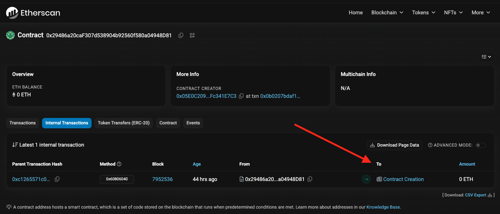

# CrowdCoin

## Description
A dApp project based on Stephen Grider's "Ethereum and Solidity: The Complete Developer's Guide" course on Udemy. All contracts are deployed to the Sepolia test network.

#### Etherscan
- The factory contract that creates campaigns
    - [0x29486a20caF307d538904b92560f580a04948D81](https://sepolia.etherscan.io/address/0x29486a20caF307d538904b92560f580a04948D81)
- The [list of campaigns](https://sepolia.etherscan.io/address/0x29486a20caF307d538904b92560f580a04948D81#internaltx) that are created from the factory contract
    - On this page, you should see the list of campaigns that reside in the factory contract under the "To" tab, e.g.: 

---

## Live URL
🚀 [CrowdCoin](http://3.91.80.82:3001/)

---

## License
📝 [MIT License](https://github.com/djoshware/CrowdCoin/blob/main/LICENSE)
